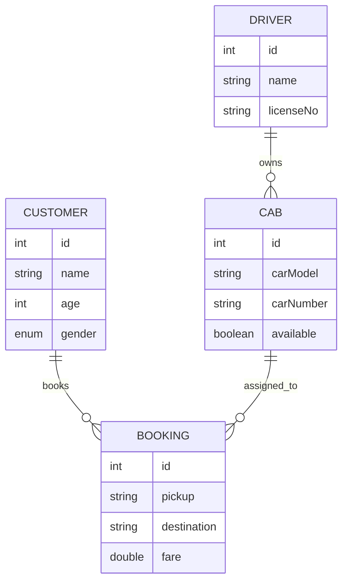

# 🚖 Trip Ease App

A simple **Cab Booking Backend System** built using **Spring Boot**.  
It simulates a real-world ride-hailing service (like Uber/Ola) with features for **Customer, Driver, Cab, and Booking management**.  

---

## 📌 Features
- 🧑‍🤝‍🧑 **Customer Management**: Add, fetch, and filter customers by age/gender.  
- 👨‍✈️ **Driver Management**: Register and manage drivers.  
- 🚕 **Cab Management**: Register cabs and assign them to drivers.  
- 📖 **Booking System**:  
  - Customer can book a cab.  
  - System assigns an available cab randomly.  
  - Calculates bill based on per-kilometer rate.  
  - Marks the cab as unavailable after booking.  

---

## 🏗️ Architecture
The project follows a **Layered Architecture** with DTOs and Transformers for clean code:  

- **Controller Layer** → Handles API requests.  
- **Service Layer** → Business logic.  
- **Repository Layer** → Database interactions using Spring Data JPA.  
- **Model Layer** → Entities like Customer, Driver, Cab, Booking.  

---

## 🛠️ Tech Stack
- **Backend**: Spring Boot  
- **Database**: MySQL (via Spring Data JPA)  
- **Build Tool**: Maven  
- **Language**: Java 17+  

---

## 🔑 API Endpoints

### 👤 Customer
- `POST /customer/add` → Add a new customer  
- `GET /customer/get/customer-id/{id}` → Get customer by ID  
- `GET /customer/getByGender/{gender}` → Get customers by gender  
- `GET /customer/getAgeAndGender?age={age}&gender={gender}` → Filter customers  
- `GET /customer/getCustomers` → Get all customers  
- `GET /customer/genderAndAgeGreaterThan?age={age}&gender={gender}` → Advanced filter  

### 👨‍✈️ Driver
- `POST /driver/add` → Add a new driver  

### 🚕 Cab
- `POST /cab/register/driver/{driverId}` → Register a cab for a driver  

### 📖 Booking
- `POST /booking/book/customer/{customerId}` → Book a cab for a customer  

---


```markdown
## Database Schema (ERD)




🚀 Getting Started
1️⃣ Clone the Repository
git clone https://github.com/Sahil-Ali-01/TripEaseApp.git
cd TaxiBookingApp

2️⃣ Configure Database

Update application.properties with your MySQL username & password.

spring.datasource.url=jdbc:mysql://localhost:3306/taxi_booking  
spring.datasource.username=root  
spring.datasource.password=your_password  
spring.jpa.hibernate.ddl-auto=update  

3️⃣ Run the App
mvn spring-boot:run

4️⃣ Test APIs

Use Postman or cURL to test the endpoints.

📌 Future Enhancements

✅ Add ride history per customer.

✅ Implement dynamic pricing.

✅ Add authentication (JWT).

✅ Integrate Google Maps API for distance calculation.

🤝 Contributing

Pull requests are welcome. For major changes, please open an issue first to discuss what you would like to change.

📜 License

This project is licensed under the MIT License – feel free to use and modify it.

### Connected with me:

LinkedIn:[https://www.linkedin.com/in/sahil189alig/]


Thank you for visiting the page!
